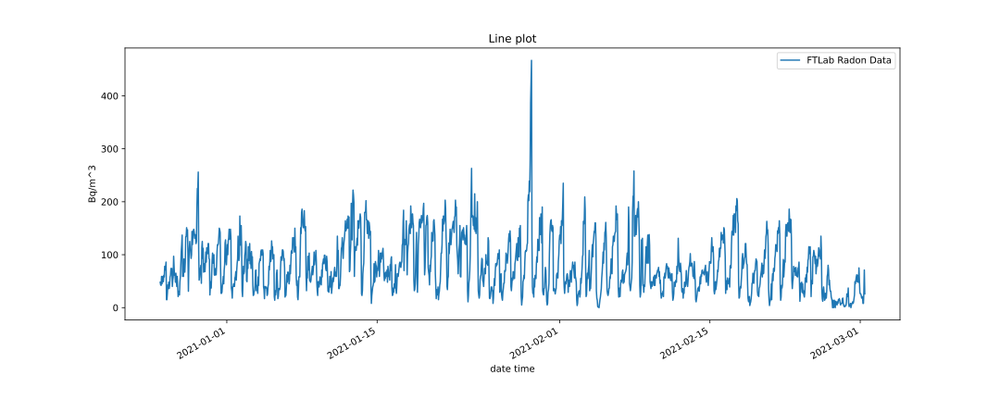
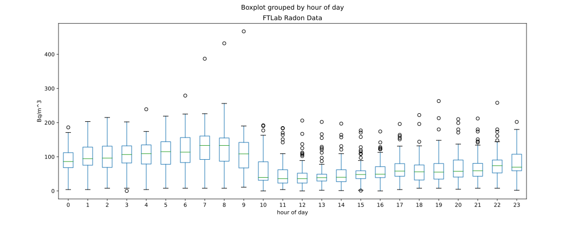

# RadonEye RD200 Home Radon Detector
The purpose of the following repository is to analyze log files of a radon detection. The detector used is the ***FTLab RadonEye (BLE) - RD200***
* Radon detector (pulsed ion chamber)
* First reliable data out time is below 60min from measurement start
* [http://radonftlab.com/radon-sensor-product/radon-detector/rd200/](http://radonftlab.com/radon-sensor-product/radon-detector/rd200/)

Log files for analysis were downloaded using the smartphone app
* [iOS](https://apps.apple.com/de/app/radon-eye/id1102752893)
* [Android](https://play.google.com/store/apps/details?id=kr.ftlab.radon_eye)

## FTLab-Radon-Eye-evaluate-log
A Jupyter notebook is used for the evaluation of the Evaluate FTLab Radon Eye (BLE) log files. Plots are generated for better visualization.

[EvaluateLog.ipynb](EvaluateLog.ipynb)

### Created plots
Measurements displayed as line plot for the overall time.

Measurements grouped for overall time grouped by the hours of the day.

## Using the Docker file
Run the script '.devcontainer/docker_build_run.sh'. Jupyter notebook has been executed using Python 3.9.
- Building the Docker image using `.devcontainer/docker_build_run.sh -b 3.9`
- Running the Docker container using `.devcontainer/docker_build_run.sh -r 3.9`
